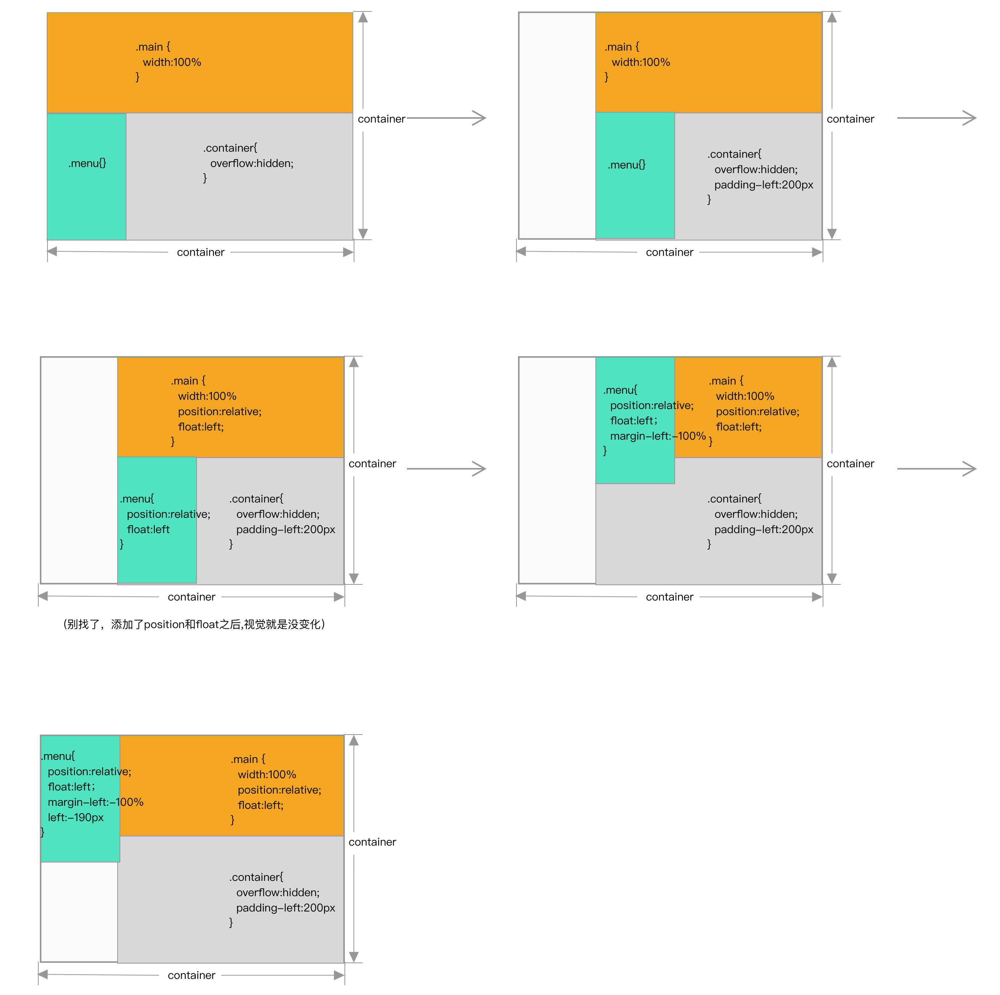

上一回刚刚讲完页头、菜单和页脚，这次该说页面主体的栏目布局了。

其实我们讲到菜单栏时就有用到一部分——双栏布局，同时也需要解决遗留的 SEO 问题

## 双栏布局
说起双栏布局很容易就能想到使用 float、absolute 改变文档流的方向，以达到双栏的效果。

但是我认为大部分场景下absolute 不适合做双栏的布局，absolute 一半多使用在元素与其他元素的联系不紧密的时候。在宽度方面，双栏布局需要两栏之间互相作用；高度方面，双栏布局需要父元素高度跟随子元素高度，避免高度塌陷，absoulte 很明显不适合了。

当不考虑对 IE9 的兼容的时候，其实还有另外一种绝佳的布局方式 ——flex，但是国内大环境下还是有比较多的单位使用 IE8,IE9,所以了解兼容性较强的布局方式还是比较有优势的

### 一栏宽度固定一栏宽度不固定
其实上一节在讲菜单与主体之间布局的时候，菜单栏是宽度固定的一栏，内容栏是宽度不固定的一栏，我们已经讲解了较为优秀的布局方式，让我们再复习一下：

对菜单设置 float:left，使主体的 margin-left = 菜单栏宽度 + 间隙，

但是如果页面的主体内容在右侧，如何优雅的实现页面主体内容在文档流前侧的布局呢？

### SEO！优秀！

```
<div class="container">
  <div class="main">
    Lorem ipsum dolor sit amet, consectetur adipisicing elit. Accusamus accusantium aliquid atque, aut consequunturdeserunt dignissimos dolores doloribus facere ipsum, mollitia natus neque quia quidem quisquam, quo recusandae sitvel!
  </div>
  <div class="menu">
    Lorem ipsum dolor sit amet, consectetur adipisicing elit. Ducimus ipsam modi saepe voluptatum! Adipisci eum harumhic inventore ipsa modi velit? Blanditiis consequatur dicta dolor eius ipsam quas suscipit temporibus.
  </div>
</div>
```

```css
.container {
  overflow:hidden:		//避免高度坍塌
  padding-left: 200px;//给菜单留位置
}

.main {
  position: relative;
  float: left;			
  width: 100%;				//中间模块占宽度100%
}

.menu {
  position: relative;
  float: left;
  width: 190px;
  height: 300px;
  margin-left: -100%;//向左移动父元素宽度，其实是将元素从中间块移到与中间块重叠，并且在中间块左边
  left: -190px;				//移出中间块，出现在左侧
  background: aqua;
}
```

感觉没看懂？让我们来演示一下：



> 由于图片篇幅限制以及避免无关因素的干扰，对 background 以及其他无关属性的定义在图中的代码并不会直接体现。


但是以上的解决思路都是针对左右两栏宽度，当左右两栏都是自适应的时候，又要如何布局呢？

### 两栏宽度都不固定
当两栏宽度都不固定时，显然我们不能使用 margin-left 将左右两边分离了，但是我们可以使右边部分变为 BFC元素让左右两边互不影响

```
aside {
  float: left;
}
section {
  overflow: hidden;
}
```
使左右两栏互不影响，轻松实现双栏布局

### 进阶：左右两侧等高
还是一种很常见的业务场景，左右两侧内容由 js 渲染，所以高度未知，但是要求渲染结束后视觉上左右两侧等高，这要怎么实现！我们要巧妙的利用

##### 负边距
```
<div class='colunm-box'>
  <div class='column-left'>
    <ul>
      <li>123</li>
      <li>123</li>
      <li>123</li>
      <li>123</li>
    </ul>
  </div>
  <div class='column-right'>
    <ul>
      <li>123</li>
      <li>123</li>
    </ul>
  </div>
</div>
```
```
.colunm-box {
  overflow: hidden;		//溢出隐藏
}
.column-left{
  float: left;
}
.column-right {
  float: left;
}
.column-left,
.column-right {
  margin-bottom: -999px;	//负的外边距与内边距抵消
  padding-bottom: 999px;	//内边距补偿
}
```
很有意思的代码，左右两侧任意一列高度增加，父容器的高度就被撑到相应高度，较低的一列会使用内边距补偿这一高度差，这样就间接实现了等高布局。不过如上所说，这样的代码看上去很有意思（奇怪），并且底部的边框不能正常显示.

骚操作了解一下好了，实现左右两侧等高更好的布局方式是 display: table-cell

##### Table
还可以使用Table布局，将左右两列模拟为单元格，就简单的实现了高度自适应

```
.colunm-box {
  overflow: hidden;
  display:table;
}
.colunm-left, .colunm-right{
  display:table-cell;
}
```
>实现等高布局，毫无疑问，display:table-cell是首选，这就好比鼹鼠，生下来就是为了打洞用的。考虑到匿名创建表格元素的问题，所有table-cell元素外一定要留有一个用来包裹的标签。
>
>匿名创建表格元素：如果设置了display:table-cell的元素的父元素不是display:table-row，父元素的父元素不是display:table，那么浏览器会自动创建相应的匿名元素
>
>于是，我们有类似下面的CSS代码：

```
.list_row{display:table-row;}
.list_cell{display:table-cell; width:30%; padding:1.6%; background-color:#f5f5f5;}
/*中间一个元素背景淡蓝，有别于两边的淡灰色*/
.list_center{background-color:#f0f3f9;}
```
而且使用 display:table-cell 还可以实现上方宽度固定与宽度不固定的两栏布局，但是同时，display:table-cell也有致命之处，我们在居中一节中已经提及过，再来复习一遍：

> display:table-cell 设置margin无效
>
> Display:table-cell 对 width 敏感，设置 width:100% 时，不同浏览器会显示出不同的效果

##### Flex

如果不考虑对 IE9 的兼容，可以使用flex布局，只需要对父元素设置布局方式为flex就可以了， so easy！

## 三栏布局
三栏布局是将正常的文档流分为左中右三栏，一般业务场景来讲，左边与右边的栏目宽度固定，可能是菜单栏、分类等栏目，中间的栏目是页面主体部分。

### 流体布局
```
<div class="three-column">
  <div >something...</div>//左栏
  <div >something...</div>//右栏
  <div >Lorem ipsum dolor sit amet,</div>//中间栏
</div>
```
```
.three-column {
  width: 600px;
  height: 300px;
}
.three-column div {
  border: solid 1px #666666;
  height: 300px;
}
.three-column div:nth-child(1){//左边
  width: 120px;
  float:left;//左边的模块向左浮动
}
.three-column div:nth-child(3) {//中间
  margin: 0 240px 0 120px;
}
.three-column div:nth-child(2) {//右边
  width: 240px;
  float:right;//右边的模块向右浮动
}
```
三栏布局内最简单的流体布局了，利用流体特性， 使左边的模块向左浮动，右边的模块向右浮动，中间的模块顺着文档流的方向顺推达到三栏布局的目的，简单粗暴。

但是用流体布局的缺点也很明显，中间的部分最后显示，当网络环境不友好的时候不利于用户体验，不利于SEO

### 双翼飞布局
为了解决中间的部分最后显示的问题，可以使用双飞翼布局

```
<div class="three-column clearfix">
  <div>Lorem ipsum dolor sit amet,</div>//中间栏
  <div >Lorem ipsum dolor sit amet, consectetur adipisicing elit. </div>//左栏
  <div >Lorem ipsum dolor sit amet, consectetur adipisicing elit. </div>//右栏
</div>
```
```
.three-column {
  margin-left: 120px;			//给左栏留位置
  margin-right: 220px;		//给右栏留位置
}
.three-column div:nth-child(1) {
  float: left;
  width: 100%;					//中间模块占 100%宽度
  height: 300px;
}
.three-column div:nth-child(2){
  position: relative;
  width: 100px;
  height: 300px;
  margin-left: -100%;		//向左移动父元素的宽度，其实是将元素从中间块移到与中间块重叠并且在左边
  left: -120px;					//移出 three-column ，出现在左列
}
.three-column div:nth-child(3) {
  position: relative;
  width: 200px;
  height: 300px;
  margin-left: -200px; 	//向左移自己的宽度，使元素从中间块下面移到与中间块重叠并且在右边
  right: -220px;				//移出中间块，出现在右侧
}
```
咦？似曾相识？dei！就是和双栏布局 SEO 的优化一样，只不过是额外增加了右栏。

双飞翼布局的优缺点都很明显，牺牲代码易懂度与简洁度来达到先渲染中间块的效果，如果不看css添加的注释，新入门的前端同学可能根本搞不清楚上面的代码是在做什么，但是如果强调 SEO的话，还是双翼飞布局更好一些

### 三栏平分，并且每两栏之前右相同空隙
三栏平分每两栏之间有空隙，自然而然就能想到使每栏都带有 margin-right:10px，再使用子元素选择器使最后一个元素的 margin-right:0px ,在这里，我们有一种更优雅的方法实现三栏平分

```
 <div class="three-column-warp">
    <div class="three-column">
      <div>Lorem ipsum dolor sit amet</div>//左
      <div>Lorem ipsum dolor sit amet</div>//中
      <div>Lorem ipsum dolor sit amet</div>//
    </div>
  </div>
```
```
  .three-column-warp {
    overflow: hidden;			//隐藏因为margin-right带来的滚动条问题
  }
  .three-column {
    overflow: hidden;			//解决子元素浮动带来的高度塌陷
    margin-right: -10px;	//处理最后的margin
  }
  .three-column div {
    float: left;							//文档流向左浮动
    width: calc(33.3% - 12px);//计算每一列的宽度 33.3 - content-border-			padding
    height: 200px;
    margin-right: 10px;				//每一列元素带的 margin
    border: 1px solid #666666;
  }
```
要注意两个overflow的作用不一样， three-column的 overflow 可以替换其他清除浮动的方法，但是 warp 的 overflow， 目前我还没有找到更优的方式解决滚动条带来的问题

