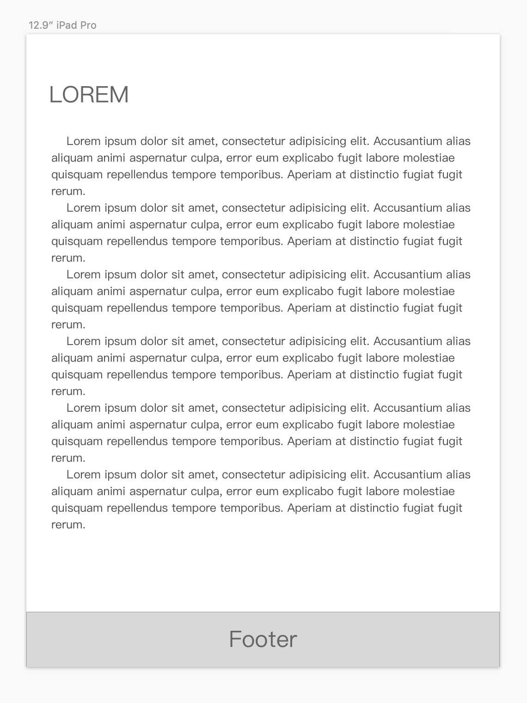

## 页头固定
网页上的 header 相对浏览器窗口固定是最常见不过的需求了，但是对于新手可能还摸不到门路，我们可以使用fixed 固定 header,达到以下效果：

### 页面滚动而页头不滚动：


```css
header {
  height: 30px;
  position: fixed;
  width: 100%;//注意设置width使宽度达到父元素 100% 贯穿屏幕从左到右
}
```
## 菜单栏固定
除了页头固定，我们经常遇见下方gif所展示的业务场景：


我们要解决的三个问题是

1.菜单栏在左正文在右，并且正文宽度不固定

2.左边菜单栏的高度随浏览器高度的变化而变化

3.左边菜单栏不随右边正文部分的滚动而滚动

我们依次解决：

### question 1: 菜单栏在左，正文在右，并且正文宽度自适应
菜单栏在左正文在右，这种改变文档流的布局大家自然能想到利用 float 实现布局，

```
aside {
  float:left
}
```


但是布局的菜单部分与右边正文部分分界并不明显，我们需要借助正文部分的 margin 使两边分界明显：

```
section {
  margin-left:220px;//margin-left = 左边菜单宽度 + 分割的间距 
}
```
### question 2: 左边菜单栏高度随浏览器高度的变化而变化
Height:100% ? 哦并不，在正常文档流下，设置高度的值为 100% 并不会起任何效果，这个问题需要与 question 3: 左边菜单栏不随右边正文部分的滚动而滚动 一起解决。

既然在正常文档流下， 设置高度 100% 不会起任何效果，那么我们改变文档流呢？比如说借助 position:fixed:

```
aside {
  float:left;
  position: fixed;
  height: 100%
}
```
这样就可以实现我们想要的效果了。

但是学习是不能轻易满足的，当菜单栏类目增加，并且

### 菜单栏本身需要滚动，且和正文的滚动互不干扰
首先要拆分需求，可以发现我们真实的诉求其实是：给菜单栏单独添加一个滚动条：

还好， overflow 可以解决：

```
aside {
  overflow:scroll;
}
```


叮！一不小心，出现了更高级（混合）的需求：

### 同一个页面中同时需要固定的菜单栏和页头
我们把刚刚学习的固定菜单栏与页头放到同一个页面上，会发现不是菜单栏遮挡了页头就是页头遮挡了菜单栏。但是你还记得刚刚学习的如何使菜单栏与正文部分分离么？我们又可以故技重施了:

```
header {
  margin-left:200px
}
```
但是我们发现—咦？正文部分怎么被遮挡了一块


我们继续对 正文部分施以 margin-top 时，却发现不管用了


正文部分的 section 不仅仅把自己推下来了，还把菜单栏以及 header 推下来了，检查元素后我们发现， 对正文部分设置的 margin-top, 正文部分的 margin-top 与 body 部分的 margin-top 发生了margin 合并，解决此处 margin 合并的办法有很多， 可以对对父元素（body）设置成 BFC 元素、给body加 1px 的padding，使 section 的 margin-top 变为 padding-top ,但是每种方法都有一些后遗症，读者可以根据自己的业务所在的情景选择使用哪种 BFC 方式

>块格式化上下文（Block Formatting Context，BFC） 是Web页面的可视化CSS渲染的一部分，是布局过程中生成块级盒子的区域，也是浮动元素与其他元素的交互限定区域。
>块级格式化上下文
>BFC是一个独立的布局单元
>即这个元素的布局不会影响到其它的元素
### 高级：SEO

我们发现，在html文档流中，菜单栏的位置是在正文前面的，这显然不利于SEO

> SEO: （**Search Engine Optimization**）：汉译为搜索引擎优化。

考虑到搜索引擎优化，我们需要将正文部分放到菜单栏（无关紧要）的部分之前，这要如何实现呢？这里容我先卖个小关子，下一节内容我们再进行揭晓

## 页脚的难题

当我们拿到类似下面这样的设计稿：



看起来简单无比！我们只需要把footer fixed 到页面底部就可以了，但是实际使用中，当正文部分变长的时候，就会出现：


咦？ Footer 把上面正文部分遮住了，那怎么办呢？好主意！把footer放到文档流最后，不使用 fixed 了，然而……


忍不住骂出xxx

但是问题还是需要解决的：我们需要：使内容高度小于浏览器高度时页脚在页面底部，内容高度大于浏览器窗口高度时页脚在文档流最后，首先我们要调整一下html结构：

```
<div class="container">
  <header/>
  <div class="page">
    <aside/>
    <section/>
  </div>
  <footer/>
</div>
```
再利用 mini-height 与 height 的魔法解决问题：
```
body html {
  padding: 0;
  margin:0;
  height: 100%;//设置height使子元素可以设置百分比高度
}
.container {
  min-height: 100%;//使内容很少时能保持100%的高度
  position:relative;//以便于里面的元素进行绝对定位后不会跑出 div.container
}
.page {
  padding-bottom: 30px;//footer的高度
}
footer {
  position: absolute;
  height:30px
  width:100%;
  bottom:0;
}
```


