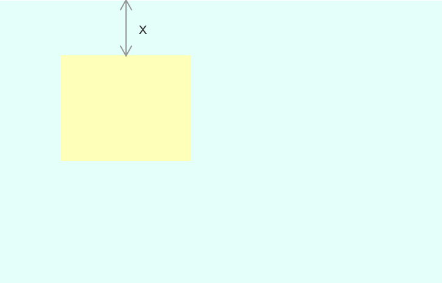
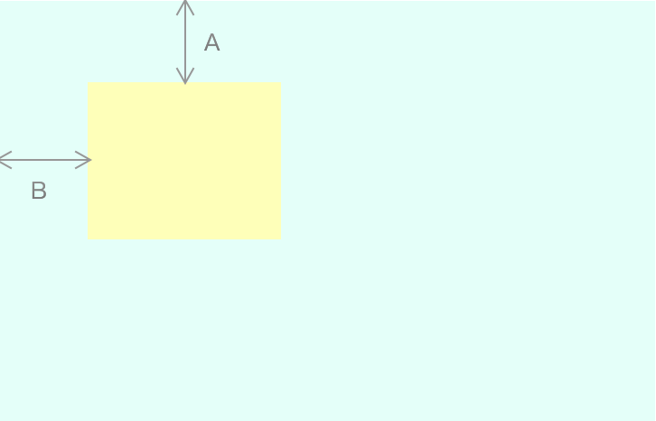
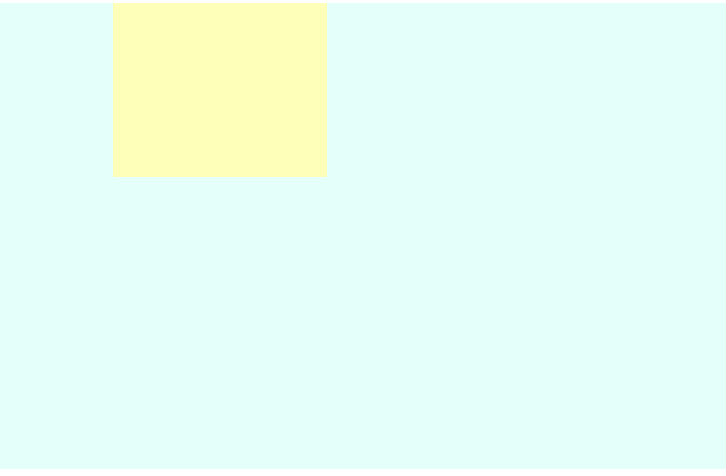
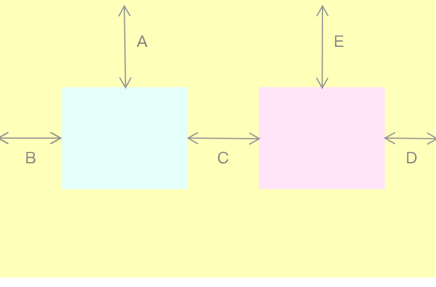
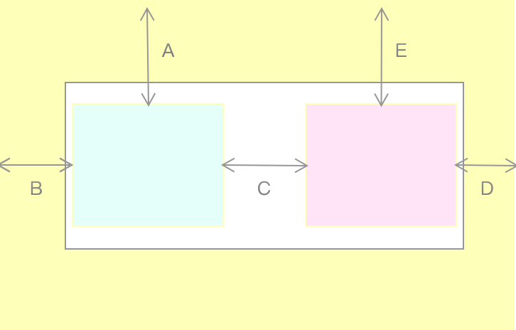

# 第1节：margin vs padding

在拿到一张设计图的时候，比较难的一个点就是判断如何什么时候用 margin， 什么时候用 padding 了，在学会使用 margin/padding 之前，我们需要知道它们是什么：

> padding属性设置一个元素的内边距，padding 区域指一个元素的内容和其边界之间的空间，该属性不能为负值。
>
> margin属性为给定元素设置所有四个（上下左右）方向的外边距属性。这是四个外边距属性设置的简写。

依照规范，padding 用于设置卡片与卡片内部的元素之间的距离， margin 用于设置卡片与卡片之间的距离。

但是这样的描述依然很含糊，在没有 background 和 border 的情况下，我们并不能很明确的判断某一块间距是属于内边距还是外边距。

更令人困惑的是：



上图， 高度 x 可以理解为黄盒子的内边距，也可以理解为蓝盒子的外边距，这就让人很烦恼了。

但是为了我们在页面重构的时候更快更有效，复用性更高，我总结了以下几种情况以及推荐使用的方式：

### 卡片包含卡片



第一种情况也是相对简单一些的情况， YellowCard 内包含 BlueCard，我们可以用CSS来表示这种情况：

```
.yellow-card {
  padding-top: 20px;
  padding-left: 20px;
}
```

然而，我们发现 A 与 B 既还可以看成 BlueCard 的外边距。对于垂直方向的边距来说，如果我们给 Blue 设置 margin 来代替给 Yellow 设置 padding：

```
.blue-card {
  margin-top: 20px;
}
```

却出现了以下的问题：



因为发生了垂直方向的 margin 合并，设置的 margin-top 并没有达到我们想要的效果，需要对 Yellow 进行 BFC，但是无论哪一种 BFC 方式，都会产生或大或小的后遗症，此时我们就可以选择将边距 A 理解成 Yellow 的内边距，改为给 Yellow 设置 padding，此时垂直方向的问题就解决了。

因为 HTML 文档流的水平方向的规则与垂直方向的规则并不一样，并且水平方向并不会发生 margin 合并，所以水平方向的考量与垂直方向也有不同，

上文提到在 Yellow 内只有 Blue 的情况下，我们推荐垂直方向使用padding， 为了水平方向的统一与易读，建议也使用 padding， 但是当 Blue 的 width 不固定，并且想使 Blue 水平居中的话，就需要将间距设置为 Blue 的 margin 代替 Yellow 的padding了。

### 包含多个卡片

 除了 Yellow 内只有一个 Blue 盒子，还有很多复杂的场景，比如：多个盒子并排显示



当多个 Card 并排显示的时候，怎么照顾他们的 margin 和 padding？

Card 并排显示，对垂直方向没有影响，垂直方向可以继续依照之前的策略，在没有额外要求的情况下使用 padding。

因为 Blue 和 Pink 在水平方向居中，所以我们需要 B = D，但是 如果 B 使用 Blue 的 margin-left, D 使用 Pink 的 margin-right， 很明显 B、 D 又不是一体的了，并且这样也实现不了元素宽度位置垂直居中，所以我们需要让 B 和 D 依托到另外一个盒子上：我们需要给 Blue 和 Pink 再增加一个父元素 BluePinkWarp，同时 BluePinkWarp 是 Yellow 的子元素，如下：



我们让 White 来完成 B 和 D，给 White 添加 margin-left 和 margin-right 分别作为 B 和 D

那么还有另外一个问题， C 是属于 Blue 的还是 Pink的？

只有两个 Card 的情况局限，如果是多个 Card 并列呢？ 了解 Bootstrap 的栅格系统的小伙伴会发现，栅格系统使用的方式是再分别给 Blue、Pink 一个父元素，对父元素设置 padding ，使 paddingLeft + paddingRight = C,并且 paddingLeft = paddingRight.

就我而言我在个人工程项目内，使用的方式是 C 属于  Blue 的 margin-right，那么 Card多了之后，最后一个 margin-right 如何处理呢？方法在上篇文章「多栏元素」中已经有啦，使用父元素的负边距令最后一个 margin-right 消失。

以上我们演示了 padding 与 margin 之间的爱恨情仇，这也是前端重构中我们避免不了的核心知识点—**盒子模型。**