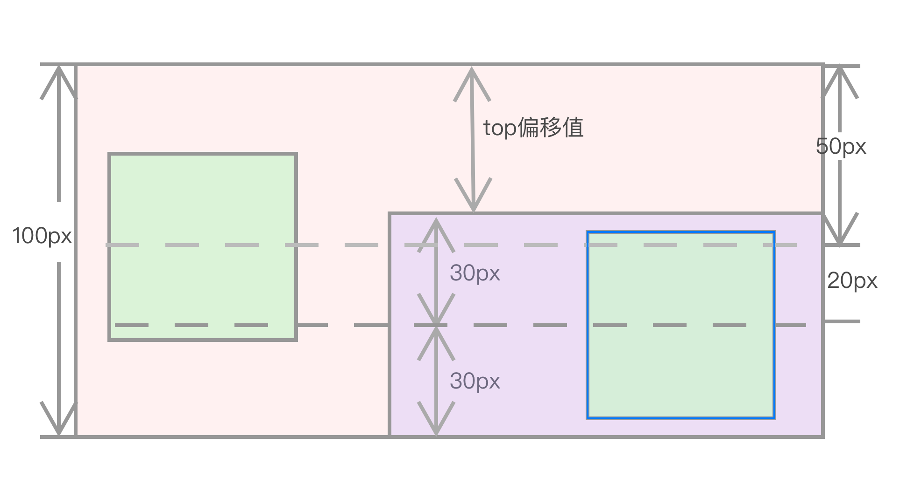
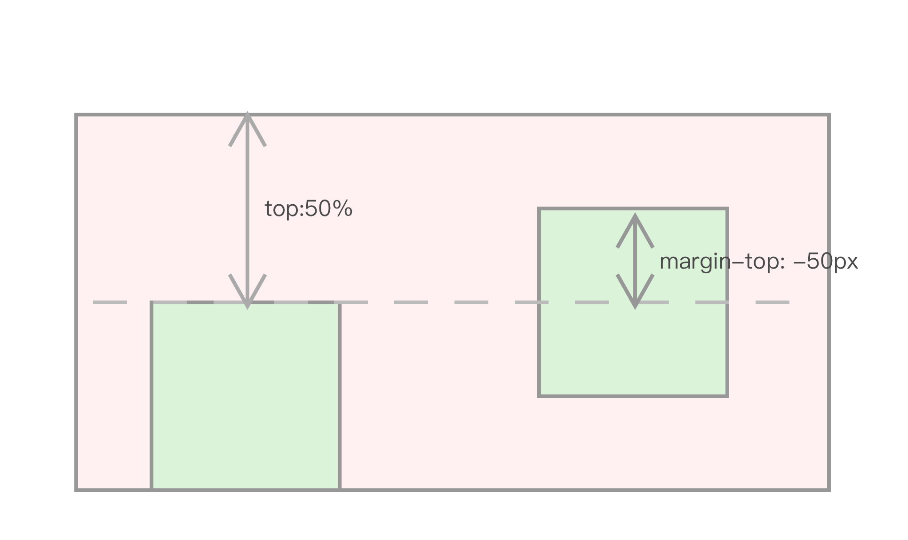

# 第2节：块状元素垂直居中

是用什么属性帮助 margin:auto 实现垂直居中呢？

### Absolute + margin:auto

CSS 2 规范 10.6.4  [Absolutely positioned, non-replaced elements](https://www.w3.org/TR/CSS2/visudet.html#abs-non-replaced-height) 中有：

> 对于 绝对定位非替换元素高度的计算规则：
> 'top' + 'margin-top' + 'border-top-width' + 'padding-top' + 'height' + 'padding-bottom' + 'border-bottom-width' + 'margin-bottom' + 'bottom' = height of containing block
>
> 并且有两个 if 与我们场景相关：
> If all three of 'top', 'height', and 'bottom' are auto, set 'top' to the static position and apply rule number three below.
> If none of the three are 'auto': If both 'margin-top' and 'margin-bottom' are 'auto', solve the equation under the extra constraint that the two margins get equal values.
> 如果 `top`, `height`, `bottom` 三个属性都是 auto,top 取当元素是`static position`时的值，其他的计算看下面三条规则（此处省略）
> 如果上面提及的三个属性都不是 auto，并且如果 margin-top 和 margin-bottom 都为 auto，平分剩余的空间使两个 margin 值相等

**那么问题就很明确了，我们可以对子元素设置 position:absolute ,并且四周的距离设置为 0 ，同时设置`margin:auto`:** 

```
<div class="parent">
  <div class="child">block元素</div>
</div>
```

```
.parent {
  position: relative;
  width: 400px;
  height: 400px;
}
.child {
  position: absolute;
  width: 150px;
  height: 150px;
  top:0;
  bottom: 0;
  left: 0;
  right: 0;
  margin: auto;
}
```

这样 .child 元素就在 parent 元素内部实现水平垂直居中
如果我们仅仅想对元素进行垂直居中，那么根据上文提到的 absolute 的规范，我们可以设置 ausolute 的属性`top:0;bottom:0` ,那么 `margin：auto` 平分上下空间使得 margin 值相等，从而实现元素单纯的垂直居中，

如果子元素要在父元素的左侧垂直居中，那么根据absolute的规范，我们设置 `left：0 ` 即可，右侧同理；当然，此方法也可以实现元素的水平居中，设置 ausolute 的属性 `left:0;right:0` ，原理相同

当我们不想使子元素进行绝对的垂直居中时，想使元素相对垂直居中的位置偏下z px时，我们把问题分解：

元素相对垂直居中的位置再向下偏移 z px -> 元素居中的中线比绝对垂直居中的中线向下偏移 z px -> top向下偏移z px * 2 

上面阐述的步骤可能不是很直观，让我们举个🌰：父元素的高度是 100 px， 我们想让子元素的位置比绝对垂直居中的位置向下偏20px，那么我们：

元素垂直居中的中线 50px + 20px -> 元素居中的中线 70px -> 元素居中的中线离父元素底部 30px  ，那么子元素绝对居中的顶部的线离父元素底部距离为 30px  *2 = 60px ，那么top的偏移值应该是 20px * 2 = 40px



通过借助绝对定位与 margin:auto 使元素居中是规范中明确规定的，没有二意性而且大部分浏览器都有实现，没有兼容问题，而且我们现在也没有发现什么特殊的场景让使`absolute`+`margin:auto` 对块级元素的居中不能完美适配。

但是借助 top， bottom = 0 时垂直居中，我们还可以借助另一种方式使 margin 可以帮助元素实现垂直居中

### Absolute + 负margin

```
.parent {
    position: relative;
    width: 600px;
    height: 300px;
}
.child {
    position: absolute;
    width: 100px;
    height: 100px;
    top: 50%;
    margin-top: -50px; //(content+padding+border)/2: ;
}
```

先使用 top: 50%（根据父元素height计算）,将子元素的 top 线推到父元素的中线处，

再根据 margin-top:-50px（子元素高度的一半），将子元素推上去，使子元素与父元素的中线一致。



但是这种方式很遗憾的是必须元素的 height 已知，那如果元素的 height 未知，怎么办？

<u>负margin小技巧：</u>

> 负margin-top:元素上移
>
> 负margin-left:元素左移

**要注意的是 `margin-right` 与 `margin-bottom` 的移动规则与 `margin-top` 和 `margin-left` 不一样，也不能借此实现该元素的水平垂直居中。**

### absolute + translate

我们可以使用 `translate`， 使子元素移动：

```
.chlid {
    position: absolute;
    top: 50%;
    transform: translate(0, -50%);
}
```

利用 `transform` 将子元素推上去子元素的 50%,

这种方式令元素垂直居中的缺点是不是所有浏览器都支持，遇到了头疼的 IE8 ， `transform` 就直接歇菜了。


到此，我们只了解了块状元素居中的方式，在文档流中，除了块状元素还有另外一大块——行内元素。相比块状元素而言，行内元素的居中更为难以理解和复杂，所以，你准备好了么？

## 