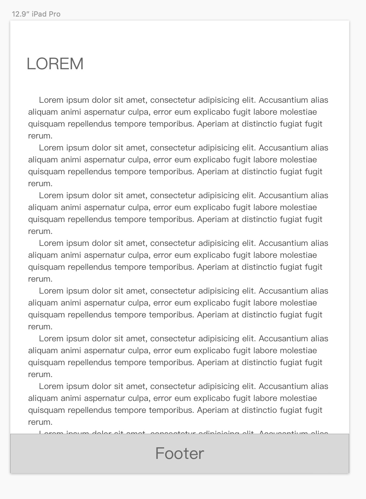

# 第3节：页脚

当我们拿到类似下面这样的设计稿：


看起来简单无比！我们只需要把footer fixed 到页面底部就可以了，但是实际使用中，当正文部分变长的时候，就会出现：



咦？ Footer 把上面正文部分遮住了，那怎么办呢？好主意！把footer放到文档流最后，不使用 fixed 了，然而……


忍不住骂出xxx

但是问题还是需要解决的：我们需要：使内容高度小于浏览器高度时页脚在页面底部，内容高度大于浏览器窗口高度时页脚在文档流最后，首先我们要调整一下html结构：

```
<div class="container">
  <header/>
  <div class="page">
    <aside/>
    <section/>
  </div>
  <footer/>
</div>
```
再利用 mini-height 与 height 的魔法解决问题：
```
body html {
  padding: 0;
  margin:0;
  height: 100%;//设置height使子元素可以设置百分比高度
}
.container {
  min-height: 100%;//使内容很少时能保持100%的高度
  position:relative;//以便于里面的元素进行绝对定位后不会跑出 div.container
}
.page {
  padding-bottom: 30px;//footer的高度
}
footer {
  position: absolute;
  height:30px
  width:100%;
  bottom:0;
}
```
