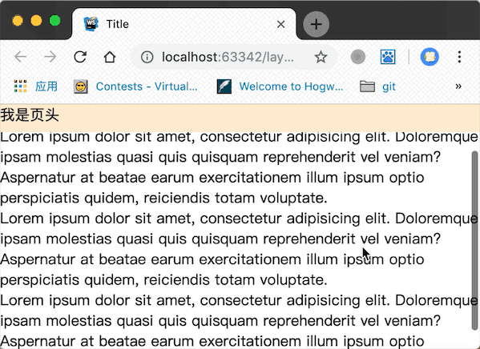

# 第1节：页头

网页上的 header 相对浏览器窗口固定是最常见不过的需求了，但是对于新手可能还摸不到门路，我们可以使用fixed 固定 header,达到以下效果：

### 页面滚动而页头不滚动：


```css
header {
  height: 30px;
  position: fixed;
  width: 100%;//注意设置width使宽度达到父元素 100% 贯穿屏幕从左到右
}
```